# Documento de prueba para sistema “prueba-técnica”

## Índice
- [Stack y alcance](#stack-y-alcance)
- [Cómo correr las pruebas](#cómo-correr-las-pruebas)
- [Unit & Integration (Jest + RTL)](#unit--integration-jest--rtl)
- [End-to-End (Cypress)](#end-to-end-cypress)
- [Cobertura de código](#cobertura-de-código)
- [Análisis visual (Figma vs UI)](#análisis-visual-figma-vs-ui)
- [Decisiones de diseño de pruebas](#decisiones-de-diseño-de-pruebas)
- [Algunos casos de pruebas](#algunos-casos-pruebas)
- [Representación test unitarios y E2E](#Representacion-test-unitarios-y-E2E)

---

## Stack y alcance
**Objetivo:** Tu objetivo es asegurar la calidad de los componentes y flujos clave implementando pruebas automatizadas.
---
**Tecnologías:**
- Unit/Integration: **Jest** + **React Testing Library** (+ `@testing-library/jest-dom`)
- E2E: **Cypress** (+ `@testing-library/cypress`)
- Mock de red con **fixtures** e **intercept**; hook responsive `usePageSize` (actual: **mobile=4**, **tablet=8**, **desktop=12**)

---

## Cómo correr las pruebas

### Unit / Integration
```bash
# correr tests
npm run test

# ver cobertura
npm run test:coverage

## End-to-End (Cypress)
```
**Qué cubrimos:**
- **article-list.cy.ts**
  - Carga inicial con intercept + fixture (`/mock/articles.json`).
  - Paginación estable en **mobile** (`viewport` < 640 ⇒ `PAGE_SIZE=4`), asserts dinámicos basados en la fixture.
  - Filtrado (case-insensitive) por título/resumen; “solo espacios” (trim) no filtra.
  - Navegación next/prev con estados `disabled`.
- **search-bar.cy.ts**
  - Input visible + placeholder correcto.
  - Botón **Limpiar**: aparece con texto, borra y restaura página 1.
  - Filtrado por título/resumen (case-insensitive), sin resultados → estado vacío + navegación deshabilitada.
  - Cambiar query **resetea** a página 1.

**Ejecutar:**
```bash
npm run dev      
npm run test      
npm run test:coverage
npm run cy:open 
npm run cy:run
```
## Análisis visual (Figma vs UI)
**Diferencias observadas**

- 1.- En la versión mobile el diseño muestra que debe haber un margen entre el componente que contiene las card los bordes del dispositivo y en la implementación se puede ver que no existe aquel margen ya que va de borde a borde.:  
  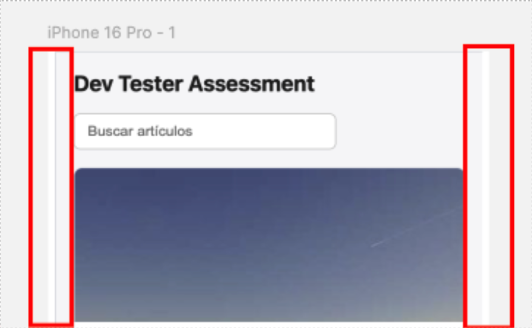
- 2.- En el diseño mobile también se asigna un ”divider” (<HR />) que en la implementación no sale:  
  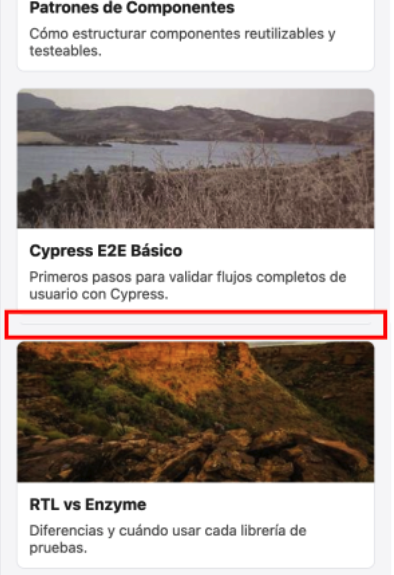

**Estado actual**

- Version Desktop:  
  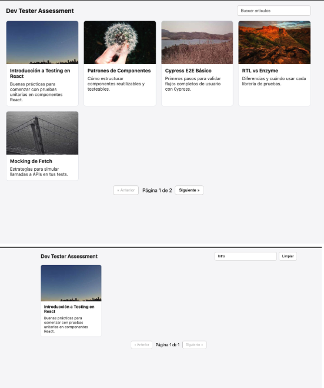
- Versión Mobile:  
  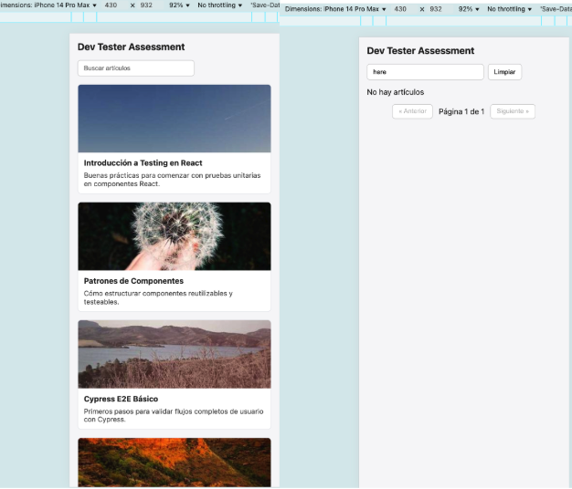

## Decisiones de diseño de pruebas

- **Selectores accesibles** primero: `getByRole(..., { name })`, `getByLabelText`, y `findBy*` en E2E.  
- **Determinismo E2E**: `cy.intercept` + fixture ⇒ sin dependencias de red.  
- **Timers en App.test**: usar `fakeTimers` solo para avanzar 200 ms y **volver** a `useRealTimers` antes de `waitFor`/`userEvent`.  
- **Responsive**:
  - RTL: mock de `matchMedia` (helper `__setViewportWidth`) **o** mock directo de `usePageSize` por test.
  - Cypress: **viewport mobile** para forzar paginación independiente del dataset.

---
## Algunos casos de pruebas

- **Ingreso de caracteres especiales** Caso de prueba con ingreso de valores “escapados” no permitidos, como signos de mayor a o menos a.


- **Caso revisión paginación.**: Donde la lista de artículos es mayor. 
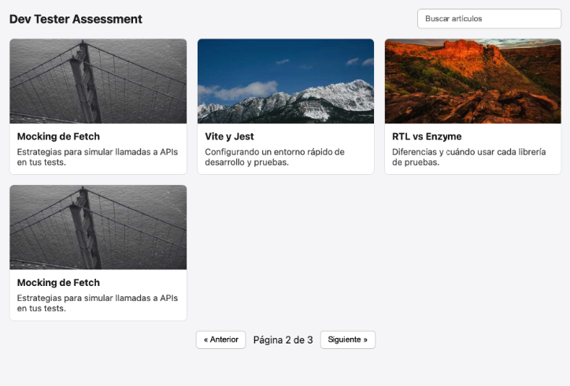
  - En este caso podemos ver como el paginado de la vista es mal organizado por un leve problema de UI y hasta de cómo puede afectar el “PROPS DRILLING” en el código o inclusive la mala delegación de responsabilidades entre los componentes. Se adjunta una pequeña propuesta que representa una gran mejora en lo visual. Riesgo: Dependencias en el código, percepción de densidad y scroll inconsistente.

- **Donde la lista de artículos es 0**: El componente de paginación no debería ser visible.
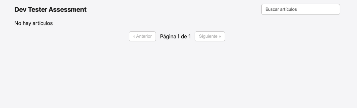

---
## Representación test unitarios y E2E

- **Test unitarios implementados**
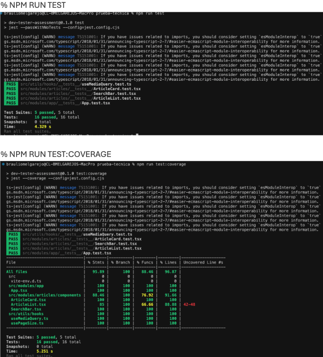

- **Test E2E implementados.**: 
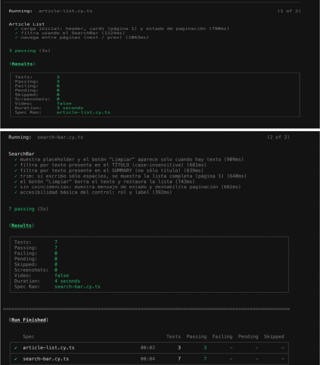

- **Test Cypress (cy:open)**: 
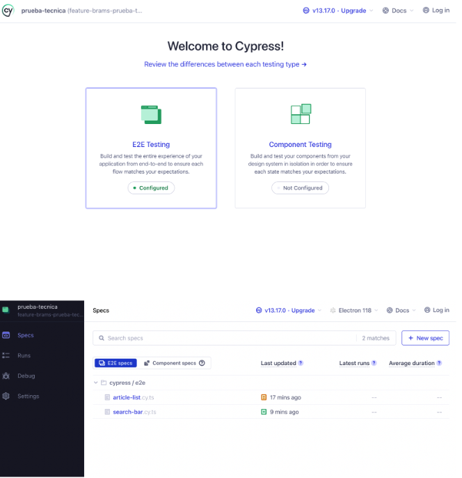

---
## Sugerencia asociada al código

- Evitar la  mala definición de responsabilidades entre componentes y el PROPS DRILLING que se comentaba un poco más arriba.

- Al corregir la pequeña diferencia de pasar desde el App component la cantidad de card a mostrar por pantalla se genera aquel problema que definí en la imagen de los casos. Al poder permitir que esto se deterine según la cantidad de card que muestra la pantalla no quedan espacios vacios ni se generan páginas innecesarias si la lista crece.

- El cambio quedó aplicado para la aplicación de casos de prueba

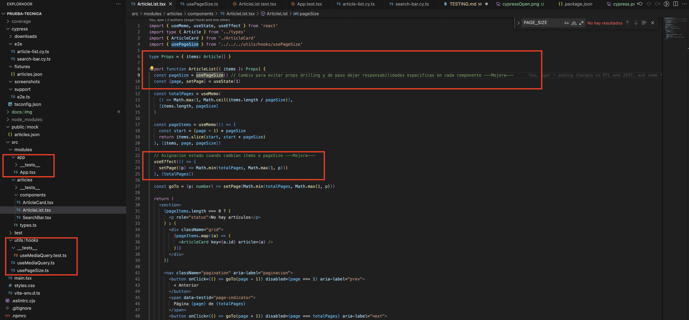
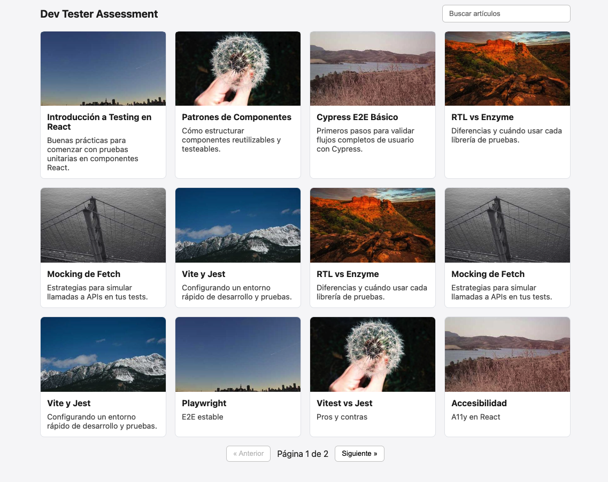
